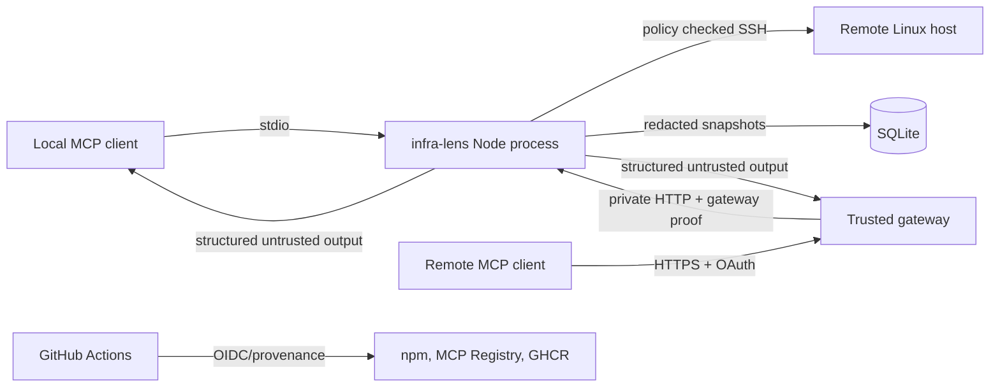

# Security threat model v1.0.0

Reviewed on 2026-07-20. The machine-readable register is [`security/threat-model.json`](../security/threat-model.json), validated by `pnpm run check:threat-model`.

## Scope and actors

Actors are local MCP users, remote authenticated users, OAuth gateways, repository maintainers, GitHub Actions, npm and MCP registries, SSH agents, remote Linux hosts, and attackers able to send HTTP requests or influence a monitored host.

Protected assets include SSH identities, host keys, target policy, gateway and bearer secrets, OAuth identity, collected host/process/network data, SQLite history, logs, release credentials, provenance, and model-visible tool output.

## Trust boundaries and flows



The highest-risk boundary is the transition from authenticated remote identity to an allowed SSH target. The package currently enforces global host, user, and port policy but does not propagate tenant claims into tool handlers. Consequently public or multi-user connector readiness remains blocked. Controlled deployments must be single-tenant, keep the Node backend private, and enforce user-to-target policy at the gateway.

## Entry points

- stdio MCP initialization, tool listing, and tool calls;
- guarded Streamable HTTP `/mcp` requests and protected-resource metadata;
- OAuth gateway proof and bearer credentials;
- tool-supplied host, username, port, host key, and collection options;
- SSH agent identities and known-host files;
- remote command output and error streams;
- SQLite history and export output;
- GitHub workflow dispatches, release tags, downloaded tooling, and registries.

## Abuse-case regression suite

Run:

```bash
pnpm run test:abuse
```

The suite validates the threat register and executes the HTTP, SSH, logging, and MCP contract tests. Together with protected CI, integration, Docker smoke, and SSH E2E jobs, it covers:

| Boundary | Automated evidence |
| --- | --- |
| Origin, Host, method, session and protocol checks | `test/unit/http-security.test.ts` |
| Bearer and gateway authentication | `test/unit/http-security.test.ts` |
| Body size, sanitized errors, rate and concurrency limits | `test/unit/http-security.test.ts` |
| SSH host/user/port policy and attempt/session limits | `test/unit/ssh.test.ts` |
| Host-key pinning and known-host verification | `test/unit/ssh.test.ts`, `test/e2e/ssh-fixture.test.ts` |
| Secret and token redaction | `test/unit/logging.test.ts` |
| Remote-safe profiles and connector-readiness contract | `test/unit/mcp.test.ts`, `scripts/check-threat-model.mjs` |
| Release lineage and npm provenance | `scripts/check-release-state.mjs` |

## Accepted risks and deployment assumptions

### Tenant-to-target authorization blocker

Global SSH allowlists do not distinguish users or tenants. This is accepted only for controlled single-tenant deployments until gateway identity and authorization claims are bound to tool execution. Public connector readiness remains false and is checked automatically. Review by 2026-09-30.

### MCP Registry publisher verification

Release workflows verify immutable tags, protected environments, npm provenance, registry versions, and container tags. The MCP Registry publisher binary download is not yet independently signature-verified by the repository. This accepted release-hardening risk is reviewed by 2026-08-31.

### Operational data sensitivity

Redaction prevents common secrets from entering logs and stored snapshots, but hostnames, process names, resource patterns, and topology remain sensitive. Operators must secure the SQLite path, backups, exports, gateway logs, and client transcripts and apply retention appropriate to their environment.

## Release gate

No change may set `mcp.json.connector_readiness.publishReady` to true while an `accepted-blocker` threat remains. High-risk threats require a mitigation or an accepted-risk record with owner, reason, residual risk, and review date. Bot and agent comments on security PRs are reviewed before merge.
